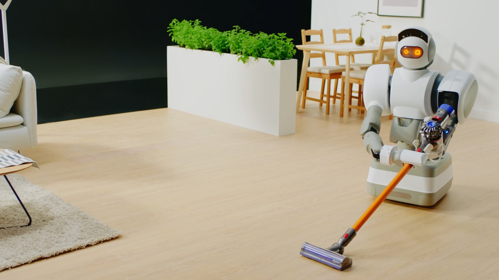

# Algortime avancées - Class et objet

Dans cette exercice, on va commencer à manipuler des `class` et des `objet` pour mieux comprendre la notion de `POO` (`Programmation Orienté Objet`).

Pour ça, on va faire un petit exercice d’algorithmie qui va utiliser les class et les objets pour nous simplifier le travail.

Dans cette exercice on va incarnées un `Robot` nettoyeur de maison :



Pour ça, on va réaliser un script qui va venir nettoyer notre maison de cette manière :


Tu verra, c'est plutôt "fun" à réaliser.

Encore une fois on va utiliser des choses que **tu ne connaîs peut-être pas encore** avec notamment la programmation orienté objet et les classes en JavaScript.

Cette exercice est une introduction, il faut toujours suivre la même règles :

> 15 (car les exercices sont plus long) minutes par parties maximum puis regarder la vidéo solution.

Chaque vidéo solution va contenir la théorie nécessaire pour effectuer les exercices.

### Part 1

Dans cette première parties on va faire en sortes de pouvoir "log" notre Maison dans la console avec toutes les différentes pièces ainsi qu'avec l'emplacement du robot.

On voudra aussi pouvoir log la batterie restante de notre robot.

```txt
🟩🟩🟩🟩🟩🟩🟩🟩🟩🟩
🤖🧼💩💩🧼
🧼💩🧼💩💩
🧼🧼💩💩💩
💩💩💩🧼🧼
💩💩💩💩💩
```

Voici le résultat finale de la console.

Pour faire ça il va falloir faire les choses suivantes :

- Créer une `class` Robot qui possède une propriétés `position` et `battery` ainsi qu'une méthode `logBattery`

  - `position` correspond à `[0, 0]`, l'emplacement de départ du robot
  - `battery` correspond à `100`, la batterie de départ du robot
  - la méthode `logBattery` va affiché un 10 carré, rouge ("🟥") ou vert ("🟩"), en fonction de la battery (60% = 6 carré vert et 4 carré rouge)

- Créer une `class` Piece qui correspond à une pièce de notre maison.

  - Cette pièce à un state qui pourra être soit `clean`, `dirty` ou `clean_by_robot` !
  - Elle aura une méthode `getEmoji` qui retournera l'emoji correspondant à son state

- Créer une `class` House qui correspond à notre maison avec comme propriété `layout` et `robot`
  - `layout` correspond à un tableau de tableau qui représente notre maison
  - `robot` correspond à notre robot

### Comment créer des class ?

Les `class` sont des sortes de modèle pour créer des objets et les objets tu les connâis déjà.

Quand on fait `"test".toUpperCase()` on appel la **méthode** `toUpperCase` de la class `String`.

Les classes `String`, `Boolean` ou `Array` sont des classes qui sont déjà présente dans JavaScript mais il est possible de créer nos propres `class`.

Pour créer une class, comme celle du robot on va utiliser le mot clé `class` puis `constructor`

```js
class Robot {
  constructor() {
    // ...
  }
}
```

Le constructeur est la méthode qui va être appelé lors de **la création** de notre robot, c'est ici qu'on va initialiser les propriétés de notre robot.

```js
class Robot {
  constructor() {
    this.battery = 100;
    // ...
  }
}
```

On pourra ensuite ajouté des méthodes comme `logBattery` :

```js
class Robot {
  constructor() {
    this.battery = 100;
    // ...
  }

  logBattery() {
    // On peut utiliser la méthode `this.battery` directement dans la méthode
    this.battery;
    // ...
  }
}
```

Je te laisse jouer, les émojis sont là pour t'aider.

⚠️ Je sais qu'il y a beaucoup de chose à faire et que c'est pas facile, accroche toi et n'hésite pas à regarder la vidéo solution.

## Partie 2

Dans cette partie on va faire en sortes que notre robot puisse se déplacer dans notre maison.

#### On va créer 3 méthodes pour notre robot :

- `checkBattery`

Cette méthode va vérifier l'état de la batterie. Si celle-ci est égal à 0, on va retourner à la case `[0,0]` qui sera notre sorte de "base" pour recharger notre robot.

Après ceci, on va définir la batterie à 100 et retourner `true` comme quoi on a bien rechargé notre robot.

Dans le cas contraire on retourne `false` comme quoi on a pas eu besoin de chargé notre robot.

Affiche des petites phrases dans la console pour savoir si on a rechargé notre robot ou non.

- `move`

Une méthode qui permet de bouger robot de 1 dans la direction donnée en paramètre.

Cette méthode prends `x` et `y` en paramètre.

Tu vas commencer par vérifier l'état de la batterie, si la méthode `checkBattery` te renvoie `true` tu dois arrêter le mouvement car on vient de recharger le robot.

Ensuite il faut vérifier que `x` et `y` sont uniquement égal à `1` ou `-1` sinon on retourne `false` car on ne peut pas bouger dans cette direction.

Pour ça tu peux vérifier la **valeur absolue** de `x` et `y` avec `Math.abs(x)` et `Math.abs(y)` qui ne doit pas être supérieur à 1.

Finalement si tout est OK, tu vas déplacer le robot en `[x, y]` et tu vas diminuer la batterie de 1 pour le coups du mouvement.

- `clean(house)`

La méthode `clean` prends en paramètre la maison.

Cette méthode va faire la même vérification que `move` pour la batterie.

Ensuite, on diminue la batterie de 0.5 pour le coup du nettoyage.

Puis on v appeler la méthode `house.clean(this.position)` pour nettoyer la case ou est actuellement notre robot.

#### On va créer 1 méthode pour notre pièce

- `clean`

La méthode `clean` va modifier la valeur de `state` de la pièce en `clean_by_robot` si la valeur actuelle est `dirty`.

#### On va créer 1 méthode pour notre maison

- `clean(position)`

On va venir récupérer la pièce à la bonne position (x et y) et on va appeler la méthode `clean` de la pièce.

💡 `this.layout[position[0]][position[1]].clean();`

### Test

Pour tester que tout fonctionne, dans la function `start` tu peux simuler des mouvements.

Par exemple tu peux créer une function qui bouge le robot en mode "serpent" de droite à gauche et de gauche à droite en appelant toujours `clean` sur chaque position.

Voilà un petit code que tu peux mettre à la fin de ta function `play` juste pour vérifier que tout fonctionne bien :

```js
let direction = 1;

for (let i = 0; i < houseSize[0]; i++) {
  for (let j = 0; j < houseSize[1]; j++) {
    console.clear();

    robot.logBattery();
    house.logLayout();
    robot.move(direction, 0);
    robot.clean(house);
    await new Promise((resolve) => setTimeout(resolve, 1000));
  }
  robot.move(0, 1);
  direction = direction === 1 ? -1 : 1;
  robot.clean(house);
}
```

⚠️ Ce code ne fonctionne pas bien, il est juste là pour te montrer que tout le code que tu as produit fonctionne correctement. Tu devrais voir le robot bouge et faire un peu n'importe quoi mais on vas s'occuper de la logique dans la partie 4.

### Partie 3

Deux petites méthodes avant le grand finale de notre exerice.

Afin de réaliser la suite, on aura besoin de 2 autres méthodes :

#### Piece

On va créer des `getter` pour notre pièce. Les `getter` sont des sortes de méthode qui ne prennes aucun paramètre.

La grande différence c'est la manière de les appelés.

Pour notre `Piece` on vas créer un `getter` pour `isDirty` et `isClean`.

Voici à quoi ressemble le `isClean` :

```js
class Piece {
  // ...

  get isDirty() {
    return this.state === 'dirty';
  }
}

const piece = new Piece('dirty');

console.log(piece.isDirty); // true
```

Comme tu le vois, quand je fais `piece.isDirty` je n'utilises à aucun moment de parenthèse `()`.

J'appel juste ma propriétés. C'est ce qu'on appels une "propriétés calculée".

Créer une deuxième propriété calculée `isClean` qui va renvoyer `true` si la pièce est propre (le state est égal à `clean` ou `clean_by_robot`).

#### House

- `isAllClean`

Cette méthode va renvoyer `true` uniquement si **toute les pièces** de la maison sont propre.

À toi de jouer !

## Partie 4

C'est ici que tu vas t'arracher les cheveux.

C'est ici que tout deviens compliqué.

On a jouer au Lego, on vient de préparer toutes nos pièces et maintenant il faut toutes les assemblers pour créer notre application.

Pour ça on va encore créer des méthodes.

### House

- `nearestDirtyPiece`

Cette méthode va renvoyer la position de la pièce la plus proche du robot qui est sale.

Je te laisse essayer de la créer et tu trouveras dans le fichier `tips.md` pleins de tips pour t'aider dans le titre `Tips nearestDirtyPiece` !

### Robots

- `doWork`

C'est la méthode qui va gérer toute la logique pour une action.

Cette méthode va devoir :

- Récupérer la pièce la plus proche
- Trouver le delta (la différence) entre la position du robot et la position de la pièce la plus proche
  - Pour `deltaX` et `deltaY`
- Si la différence est 0, c'est qu'on est sur une pièce sale = nettoyer
- Si la différence est position, on va déplacer le robot dans la bonne direction

N'oublie pas que tu peux déplacer uniquement le robot de 1 case à la fois.

Tu trouveras dans le fichier `tips.md` pleins d'aide sous le titre `Tips doWork`

## Conclusion

Suivant ton niveau, cette exercice était déstabilisant. Il fait intervenir de la POO que tu connaîs peut-être pas ainsi que de l'alogritmie.

Ne t'en fais pas, on va tout comprendre dans les exercice qui suivent.
